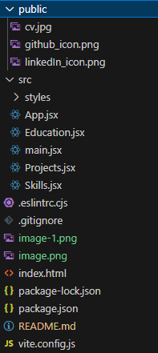

# My Portfolio
<p>Hello everyone! This is my main portfolio website. In this documentation I will show you how I made this project.</p>

# What came up to my mind
When I was planning on making this portfolio I thought that I could make this dynamic as I will be making more projects and learning new tools to add on my portfolio
<br />
 so instead of adding for example a project on html markup everytime like this:
```html

<ul>
<li>Nodejs</li>
<li>Reactjs</li>
<li>Sqlite3</li>
</ul>
<p>the description of the project</p>
<a href="link">github url</a>
```
Im just going to pull up my portfolio manager and just click a button to add project and I will be able to upload image and make all my inputs then submit it to the server

# Project Architecture

<ul>
<li>The image above shows the architecture of this project where the portfolio gets the data from the server and the server gives the data back to the client(Portfolio)</li>
<li>and the Portfolio manager makes an HTTP requests to Add, Edit or Delete data</li>
</ul>

# Project Repositories
please go to these links for <a href="#">Server docs</a> and <a href='#'>Portfolio manager docs</a>
<br />
as I will only discuss about the portfolio itself on this documentation

# File Structure

<h3>public/</h3>
I store all my static images for the links like my cv, github profile and linkedIn
<h3>src/</h3>
All the react components and styles are stored here

# Root Layout
On src/main.jsx I set my Root layout to App.jsx


# Using useState and useEffect hook
```javascript
function App() {
  const [photo,setPhoto] = useState("")
  const [aboutMe, setAboutMe] = useState("")
  const [role,setRole] = useState("")
  const [projects,setProjects] = useState([])
  const [techSkills,setTechSkills] = useState([])
  const [tools,setTools] = useState([])
  const [softSkills,setSoftSkills] = useState([])
  const [education, setEducation] = useState([])
  useEffect(() => {
    (async() => {
      const displayPhotoUrl = import.meta.env.VITE_API_URL_PHOTO;
      const dataUrl = import.meta.env.VITE_API_URL_DATA;
      const response_Photo = await fetch(displayPhotoUrl)
      const response_data = await fetch(dataUrl)

      // const devPhotoRoute = import.meta.env.VITE_API_DEV_PHOTO_ROUTE
      // const devDataRoute = import.meta.env.VITE_API_DEV_DATA_ROUTE
      // const response_Photo = await fetch(`http://localhost:3000/${devPhotoRoute}`)
      // const response_data = await fetch(`http://localhost:3000/${devDataRoute}`)

      const data = await response_data.json()
      setProjects(data.projects)
      setRole(data.role)
      setAboutMe(data.about_me)
      setPhoto(response_Photo.url)
      setTechSkills(data.skills[0].technical_skills)
      setTools(data.skills[0].tools)
      setSoftSkills(data.skills[0].soft_skills)
      setEducation(data.education)
    })()
  },[])
  ```
  Here in this code I used useEffect hook to get the display photo and the JSON data from the server and store the data that I need using useState hook

  <strong>Take Note: </strong>
  Those commented out code are used for development purposes

  # Child Components
  <p>On my portfolio I got different sections Project, Skills and Education and I assigned all these
  components as a Children of the App component so I could just pass the props from the App component into a particular child</p>

  <h2>Projects.jsx Component</h2>
 On the App.jsx it returns one of this html markup. As you can see I put the <strong>Projects component</strong> in the section tag and pass the projects from the useState as a prop which is named as "projects" 


 ```html
 <section className = "projects_section">
  <h1 id = "projects" className = "section_header">Projects</h1>
  <Projects projects={projects} />
</section>
```
On the Projects.jsx component you can see that I use the props to get those data that we fetch from the App.jsx component.
<br />


```javascript
import { Navigation, Pagination, Scrollbar, A11y } from 'swiper/modules'
import { Swiper, SwiperSlide } from 'swiper/react'
import 'swiper/css'
import 'swiper/css/navigation'
import 'swiper/css/pagination'
import 'swiper/css/scrollbar'
const Projects = ({ projects }) => {
  
  return (
    <Swiper
      modules={[Navigation, Pagination, Scrollbar, A11y]}
      className="swiper_container"
      spaceBetween={30}
      slidesPerView={1}
      navigation
      pagination={{ clickable: true }}
    >
      {projects.map((data, index) => {
        return (
          <SwiperSlide key={index} className="swiper_slide">
           
            <h2 className = "project_name">{data.project_name}</h2>
           
            
            
            <div className='project_techUsed_container'>
            {data.tech_used.map((tech,index)=>{
              return <p className = "p-techUsed"key = {index}>{`\u2022${tech}\u00A0`}</p>
            })}
            </div>
            <p className = "project_description">{data.description}</p>
            
            <a className = "github_repo_link" href={data.github_url}>Check Github Repository</a>
           
          </SwiperSlide>
        )
      })}
      
    </Swiper>
  )
}
export default Projects
```

Another thing that you might noticed is that I used <strong>Swiper.js</strong> to make a sliding effect for the list of projects the I've done
<video controls src="Vite + React - Google Chrome 2024-04-06 18-37-31.mp4" title="Title"></video>

# Other Components(Skills.jsx and Education.jsx)
Same things applied to the other child components were we specify props into a component and use it to display expected outputs from the data that we fetch from App.jsx
